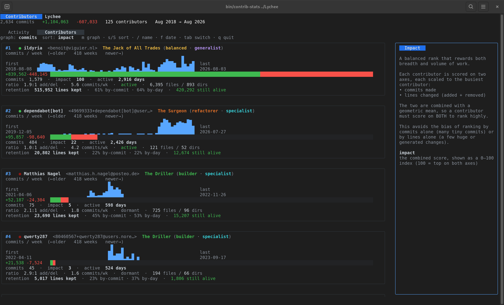
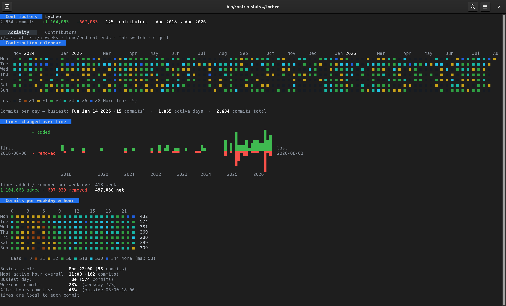

# contributors

> Because opening a browser to stare at GitHub's contribution graph is *so* 2015.

A snappy terminal UI that turns any git repository into a GitHub-style
contributors page, contribution calendar, and activity heatmap — without ever
leaving your terminal (or phoning home, or asking you to log in, or trying to
sell you Copilot... okay that last one's awkward).

Point it at a repo, and it reads your `git log`, does some tasteful math, and
paints pretty squares. That's the pitch.

## Look at it. *Look at it.*

The **Contributors** tab — a leaderboard that ranks people on *impact*, not just
who pasted the biggest dependency:



The **Activity** tab — a contribution calendar and a weekday × hour punch card
that gently exposes everyone's 3pm-Friday commit habit:



Yes, it's all in your terminal. No, we're not sorry.

---

## Why?

- You live in the terminal and consider the mouse a personal insult.
- You want to know *who actually wrote this thing* before you `git blame` in anger.
- You like heatmaps but dislike JavaScript.
- Your manager asked "who's our most impactful contributor?" and "vibes" was not
  an acceptable answer.

## Features (a.k.a. the good stuff)

- **Contributors leaderboard** — ranked by a bias-resistant **Impact** score, or
  by commits, lines changed, or most-recently-active if you're feeling opinionated.
- **Impact score** — the normalized geometric mean of commits × lines changed, so
  the person who pushed one 40,000-line vendored dependency doesn't get to call
  themselves "the top contributor." You have to be good at *both*.
- **Contribution calendar** — the little green (well, orange-to-blue now) squares
  you know and love, with the year labels and a scale that actually tells you the
  numbers.
- **Activity heatmap** — a weekday × hour punch card revealing that yes, most of
  your commits happen at 3pm on a Friday, and yes, everyone can see that now.
- **Per-contributor sparklines** — commits per week, or lines added/removed, with
  the "removed" graph politely growing downward like a proper waterfall.
- **Search & filter** — find a contributor by name/email, or hide everyone whose
  last commit predates your patience.
- **Ignore lists** — mute that bot account (or that one colleague) by name or email.
- **Identity aggregation** — the same person commits as `jane@corp.com`, `jane@personal.dev`,
  and `jdoe` depending on the machine? Merge them into one entry with `users:` in your
  config. Regex-based, so one pattern can hoover up an entire bot fleet.
- **Time & commit windows** — only care about the last six months? Set `time-window: 6`.
  Only want the top thousand commits? `commit-window: 1000`. Mix and match.
- **Email audit command** — `contributors email` prints a plain-text `name: email (N commits)`
  list sorted by activity, so you can finally answer "how many unique humans touched this
  thing?" without opening a spreadsheet.
- **On-disk caching** — keyed by `HEAD`, so it's instant on the second run and only
  rescans when the history actually changed.
- **Zero network calls** — it's just `git` and math. Your secrets are safe.

## Install

Grab the source and build it yourself:

```sh
git clone https://github.com/ildyria/contrib-stats-tui
cd resc-stats
make build        # drops a binary in ./bin/contributors
```

Or install straight into your `$GOBIN`:

```sh
make install
```

Requires **Go 1.26+** and a `git` binary on your `PATH`. That's it.

## Usage

```sh
# Analyze the current directory
contributors

# Analyze somewhere else
contributors /path/to/some/repo

# Analyze multiple repos and get an aggregate view
contributors /path/to/frontend /path/to/backend

# Sunday people, we see you
contributors --week-start sunday

# Ignore the bots and the intern's fork-bombing
contributors --ignore "dependabot[bot]" --ignore ci@example.com

# Trust no cache
contributors --no-cache

# Only look at the last 6 months of history (great for fast repos with long tails)
contributors --time-window 6

# Only look at the last 500 commits
contributors --commit-window 500

# Print a plain-text contributor list you can actually select and copy
contributors email
contributors email /path/to/repo
contributors email resc.yaml   # or any .contributors.yaml config

# Generate a starter config
contributors config
```

### Flags

| Flag              | Default   | What it does                                                        |
| ----------------- | --------- | ------------------------------------------------------------------- |
| `--week-start`    | `monday`  | First day of the calendar week (`monday` or `sunday`).              |
| `--no-cache`      | `false`   | Ignore and overwrite the on-disk cache (force a full rescan).       |
| `--ignore`        | *(none)*  | Names/emails to exclude. Repeatable or comma-separated.             |
| `--exclude-docs`  | `false`   | Ignore changes to Markdown files (`*.md`) and `docs/` folders.      |
| `--time-window`   | *(none)*  | Only consider the last N months of history (measured from HEAD).    |
| `--commit-window` | *(none)*  | Only consider the most recent N commits.                            |

### Keybindings

| Key                     | Action                                             |
| ----------------------- | -------------------------------------------------- |
| `tab` / `shift+tab`     | Switch between the Contributors and Activity tabs. |
| `1` / `2`               | Jump straight to a tab.                            |
| `←` / `→` (`h` / `l`)   | Switch tabs, or scroll weeks on the Activity tab.  |
| `↑` / `↓`               | Scroll the contributors list.                      |
| `m`                     | Toggle the per-contributor graph (commits ↔ lines).|
| `s`                     | Cycle sort: impact → commits → changes → recent.   |
| `/`                     | Search contributors by name or email.              |
| `f`                     | Filter by last-commit date (`YYYY-MM-DD`).         |
| `g` / `G`               | Jump the calendar to the start / end.              |
| `esc`                   | Clear the current search/filter.                   |
| `q` / `ctrl+c`          | Leave. We'll miss you.                             |

## Configuration

Prefer to set-and-forget? Drop a `.contributors.yaml` in your repo or home
directory (or generate one with `contributors config`):

```yaml
# Which repos to scan — paths relative to this file, or clone URLs.
# Omit to scan the current directory, or pass paths on the command line.
repositories:
  - .
  - ../sibling-repo
  - https://github.com/owner/project.git

week-start: monday
no-cache: false

# Exclude these names/emails from all statistics.
ignore:
  - dependabot[bot]
  - ci@example.com
  - "that one account that only commits 'wip'"

# Only scan the last 6 months of history. Great for large repos where the full
# history would take a while — or where "who contributed recently" is the
# question you actually want answered.
time-window: 6

# Or cap by commit count instead (or combine both — first constraint wins).
# commit-window: 500

# Merge several git identities into one contributor. Both `emails` and
# `usernames` are case-insensitive regular expressions, so one pattern can
# match an entire bot fleet. `display-email` is what shows up in the UI
# (otherwise the first email pattern does, which for bots looks hilarious).
users:
  - display-name: Jane Doe
    display-email: jane@example.com
    emails:
      - jane@example\.com
      - jane\.doe@work\.example
    usernames:
      - jdoe
  - display-name: Bots
    display-email: bots@example.com
    emails:
      - .*@users\.noreply\.github\.com
    usernames:
      - .*\[bot\]
      - dependabot
```

Environment variables work too, prefixed with `CONTRIBUTORS_`:

```sh
CONTRIBUTORS_WEEK_START=sunday contributors
CONTRIBUTORS_TIME_WINDOW=6 contributors
CONTRIBUTORS_COMMIT_WINDOW=500 contributors
```

Precedence, from loudest to quietest: **flags → env vars → config file → defaults**.

## How it works (for the curious)

The pipeline is refreshingly boring, in a good way:

1. **Collector** — streams `git log --numstat` and parses each commit.
2. **Aggregator** — folds that stream into a `Summary` on the fly, so the whole
   history is never held in memory at once. Commits from ignored authors are
   dropped before they touch a single counter.
3. **Cache** — the finished `Summary` is stored on disk, keyed by `HEAD` (and the
   ignore list, and the build), so re-runs are instant until the repo changes.
4. **UI** — [Bubble Tea](https://github.com/charmbracelet/bubbletea) +
   [Lip Gloss](https://github.com/charmbracelet/lipgloss) render everything, with
   sparklines courtesy of [ntcharts](https://github.com/NimbleMarkets/ntcharts).

## Development

```sh
make build   # build to ./bin
make run     # go run against the current dir (ARGS="..." to pass flags)
make test    # run tests (set TEST_REPO=/path/to/repo for integration tests)
make vet     # go vet
make fmt     # gofmt -s
make tidy    # go mod tidy
make help    # in case you forget all of the above
```

## Built with

[bubbletea](https://github.com/charmbracelet/bubbletea) ·
[bubbles](https://github.com/charmbracelet/bubbles) ·
[lipgloss](https://github.com/charmbracelet/lipgloss) ·
[ntcharts](https://github.com/NimbleMarkets/ntcharts) ·
[cobra](https://github.com/spf13/cobra) ·
[viper](https://github.com/spf13/viper) ·
[lo](https://github.com/samber/lo)

## Disclaimer

This repository is **100% powered by vibes** *(wink, wink)*. Tests? We ship on
gut feeling, good intentions, and the quiet confidence that `go build` exiting
`0` is basically a QA department. If something breaks, it's not a bug — it's an
*emergent feature* the vibes hadn't gotten around to yet.

(Okay, fine, there *might* be a test or two hiding in there. Don't tell the vibes.)

## License

Whatever's in [LICENSE](LICENSE). If that file is missing, assume "be nice."
